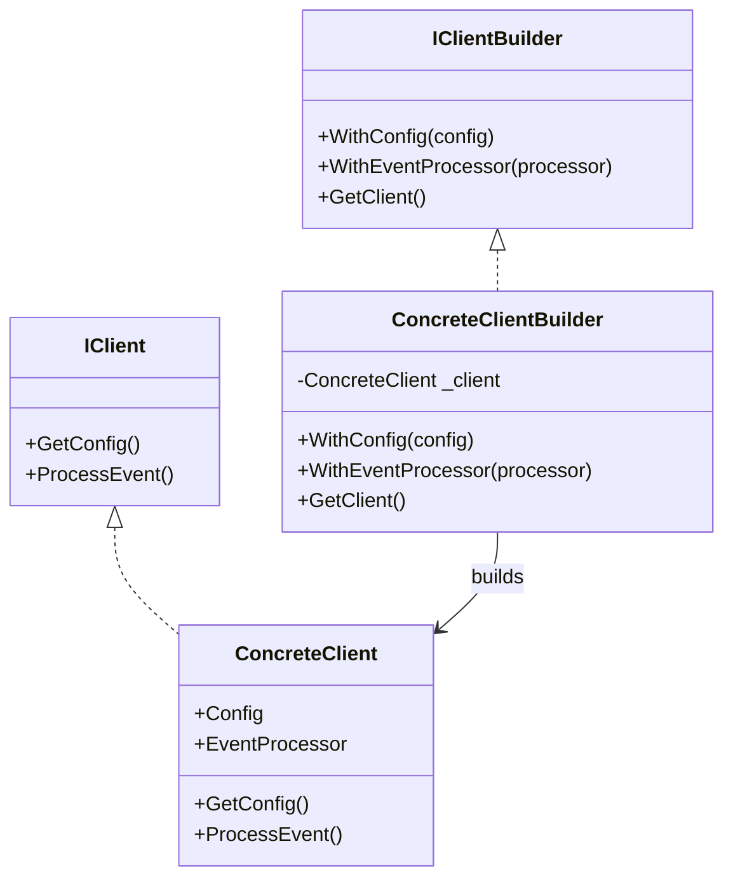

# Builder Pattern

The Builder pattern is a creational design pattern that lets you construct complex objects step by step. It separates the construction of a complex object from its representation, allowing the same construction process to create different representations.

## When to use:
- When you need to construct an object with many possible configuration options or steps
- When you want to avoid a telescoping constructor (many constructor parameters)
- When you want to reuse the construction process for different representations

## UML Diagram (Mermaid)


## Example Explanation

Suppose you want to build a `Client` object that requires a configuration and an event processor. Instead of using a constructor with many parameters, you use a builder:

- `IClientBuilder` defines the builder interface for configuring and creating a client.
- `ConcreteClientBuilder` implements the builder, allowing you to set configuration and event processor step by step, and then retrieve the built client.
- `ConcreteClient` is the product being built.

### Example Usage
```csharp
var clientBuilder = new ConcreteClientBuilder();
var client = clientBuilder
    .WithConfig("production-config.json")
    .WithEventProcessor("KafkaEventProcessor")
    .GetClient();

client.ProcessEvent();
```

You can reuse the builder to create multiple clients with different configurations, and each client remains independent.

---

**File:** [Builder.cs](./Builder.cs)
