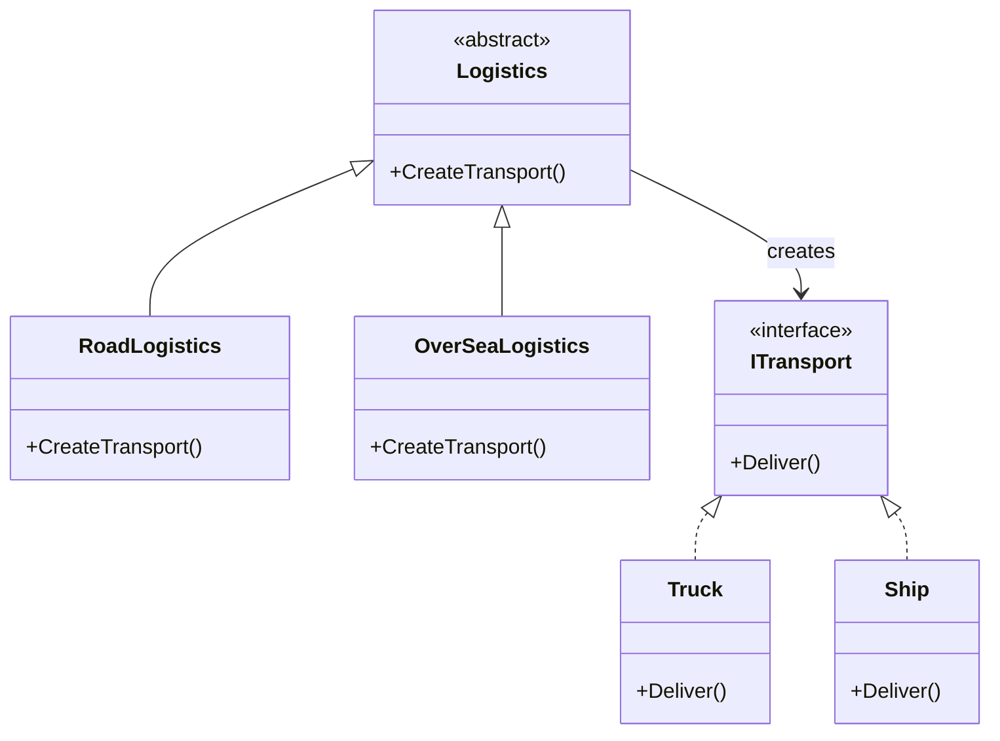
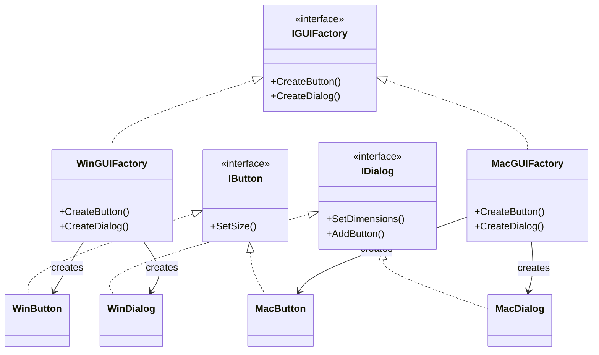

# Factory Method & Abstract Factory Patterns

## Factory Method

The Factory Method pattern defines an interface for creating an object, but lets subclasses decide which class to instantiate. It lets a class defer instantiation to subclasses.

**When to use:**
- When you need to delegate the responsibility of instantiating objects to subclasses
- When you want to decouple code from specific classes

**Mermaid Diagram:**

**File** [Factory.cs](./Factory.cs)

## Abstract Factory

The Abstract Factory pattern provides an interface for creating families of related or dependent objects without specifying their concrete classes. It ensures that products from the same family are used together.

**When to use:**
- When your code needs to work with various families of related products
- When you want to enforce consistency among products in a family

**Mermaid Diagram:**

**File:** [AbstractFactory.cs](./AbstractFactory.cs)
