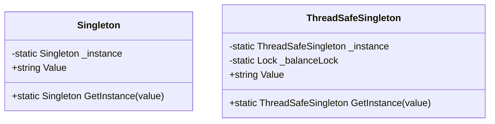

# Singleton Pattern

The **Singleton** pattern ensures a class has only one instance and provides a global point of access to it. This is useful when exactly one object is needed to coordinate actions across the system.

## When to use
- When you need exactly one instance of a class
- When you want to provide a global point of access
- When managing shared resources (e.g., configuration, logging)

## Thread Safety
- The basic singleton is not thread-safe. Multiple threads could create multiple instances.
- The thread-safe singleton uses locking to ensure only one instance is created, even in multithreaded scenarios.

## UML Diagram (Mermaid)

- `Singleton` provides a basic singleton implementation. The first call to `GetInstance` creates the instance; subsequent calls return the same instance.
- `ThreadSafeSingleton` adds a lock to ensure only one instance is created in multithreaded scenarios.

---

**File:** [Singleton.cs](./Singleton.cs)
