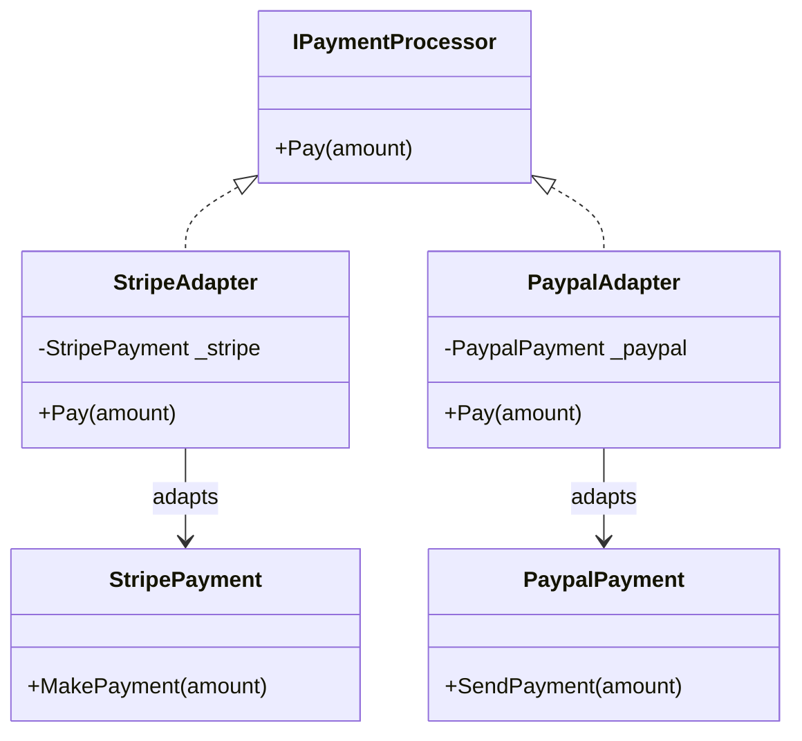

# Adapter Pattern

The Adapter pattern is a structural design pattern that allows objects with incompatible interfaces to work together. It acts as a bridge between two incompatible interfaces by wrapping an existing class with a new interface.

## When to use:
- When you want to use an existing class, but its interface does not match the one you need
- When you want to create a reusable class that cooperates with unrelated or unforeseen classes
- When you need to work with legacy or third-party code with a different interface

## UML Diagram (Mermaid)

## Example Explanation

Suppose you have two third-party payment classes: `StripePayment` and `PaypalPayment`, each with their own method for processing payments. You want to use a common interface `IPaymentProcessor` in your application.

- `StripeAdapter` and `PaypalAdapter` implement `IPaymentProcessor` and internally use the third-party classes to process payments.
- The client code interacts only with the `IPaymentProcessor` interface, making it easy to switch between payment providers.

**File:** [Adapter.cs](./Adapter.cs)
