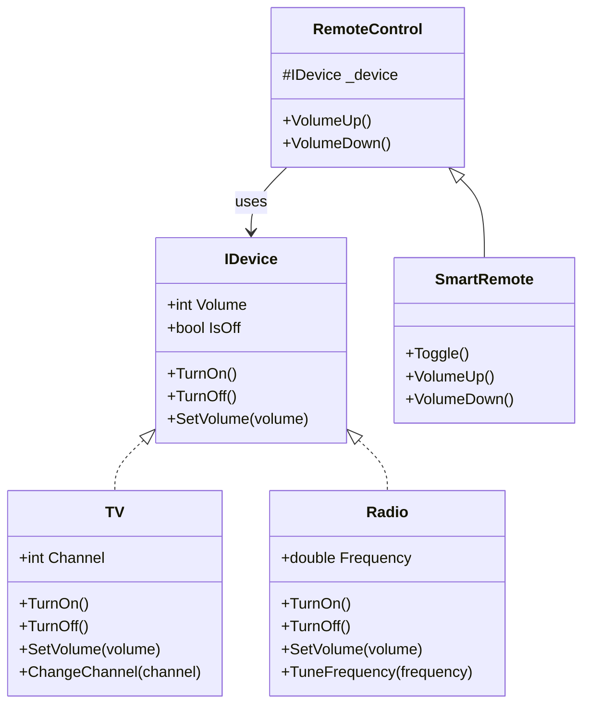

# Bridge Pattern

The Bridge pattern is a structural design pattern that separates an abstraction from its implementation so that the two can vary independently. It uses composition over inheritance to decouple the abstraction (interface) from the implementation.

## When to use:
- When you want to avoid a permanent binding between an abstraction and its implementation
- When both the abstractions and their implementations should be extensible by subclassing
- When you want to share an implementation among multiple objects
- When you need to switch implementations at runtime

## UML Diagram (Mermaid)

**File:** [Bridge.cs](./Bridge.cs)
