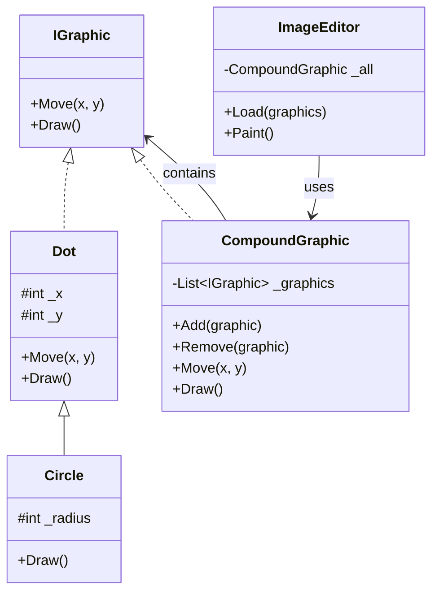

# Composite Pattern

The Composite pattern is a structural design pattern that lets you compose objects into tree structures to represent part-whole hierarchies. It allows clients to treat individual objects and compositions of objects uniformly through a common interface.

## When to use:
- When you need to represent part-whole hierarchies of objects
- When you want clients to be able to ignore the difference between compositions of objects and individual objects
- When you have a tree structure and want to perform operations on all elements uniformly
- When you need to work with objects that form a hierarchy and you want to treat both leaf and composite objects the same way

## UML Diagram (Mermaid)

## Example Explanation

In a graphics editor application, you have basic shapes like `Dot` and `Circle` that can be drawn individually. You also need to group multiple graphics together and treat them as a single unit.

- `IGraphic` is the common interface for both simple and complex graphics
- `Dot` and `Circle` are leaf components representing individual graphics
- `CompoundGraphic` is the composite that can contain multiple graphics (both simple and composite)
- `ImageEditor` loads and paints graphics without knowing whether they're individual shapes or groups
- Operations like `Draw()` and `Move()` work uniformly on both individual graphics and groups

**File:** [Composite.cs](./Composite.cs)
